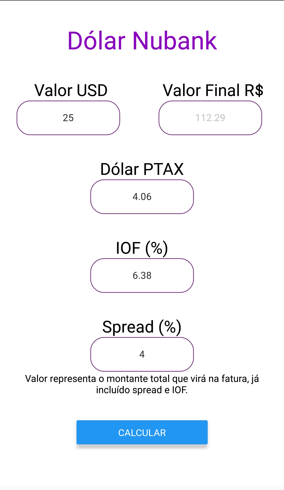

# Conversor Dollar Nubank - Digio - Neon e Outros
Saiba o valor que vai vir na fatura antes de fazer a compra

O dólar Ptax não é uma taxa obrigatória: ela serve como referência para as instituições financeiras que trabalham com câmbio.

Ficou com duvidas?

Leia: https://blog.nubank.com.br/dolar-ptax-o-que-e-e-como-funciona/

# Tela Final

<p align="center">
	<br>
	
      <br>
</p>


# Dependencias 

API: https://economia.awesomeapi.com.br/all/USD-BRL


```JAVASCRIPT
fetch(API)
    .then(res => res.json())
    .then((data) => {
      var dist = data.USD.ask;

                var cotacao = Math.round(parseFloat(dist.replace(',', '.').replace(/"/g, '')) * 100) / 100;
                this.setState({ ptax: cotacao.toString()});

                var dolar1 = this.state.dolar;
                this.state.dolar = dolar1.toString().replace(",", ".");
                var iof1 = this.state.iof;
                this.state.iof = iof1.toString().replace(",", ".");
                var spread1 = this.state.spread;;
                this.state.spread = spread1.toString().replace(",", ".");

                var sum1 = parseFloat(this.state.dolar) * parseFloat(this.state.ptax);
                var sum2 = (sum1/100) * parseFloat(this.state.spread);
                var sum3 = sum1 + sum2;
                var sum4 = (sum3/100) * parseFloat(this.state.iof);
                var sum5 = sum4 + sum3;
                this.setState({ total: sum5.toFixed(2).toString()});


    })
```
